# 🔎 HAKKINDA
Bu proje; Bursa Teknik Üniversitesi 2022 Güz Dönemi dersi olan Bilgisayar Mühendisliğine Giriş dersi için hazırlanmıştır. 

👨🏾‍💻 Sunum videosu ➜ [`tıklayın`](https://youtu.be/-LmVy9_3oUI)

# **Perceptron, Yapay sinir ağları, RNN algoritması**

*Emirhan Selçuk Aksöz*

## İçreik Tablosu

1. [Perceptron](#Perceptron)
2. [Yapay Sinir Ağları](#YSA)
3. [RNN Algoritması](#RNN)

 

# **1.	Perceptron**

Perceptron (Algılayıcı), tek katmanlı bir yapay sinir ağının temel birimidir. Eğitilebilecek tek bir yapay sinir hücresinden oluşmaktadır. Denetimli bir öğrenme algoritmasıdır. İlk kez 1957 yılında Cornell Üniversitesi’nden psikolog Frank Rosenbatt tarafından ortaya atılmıştır.

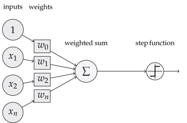

Bir perceptron dört bölümden oluşmaktadır. Bunlar :

*Giriş değerleri
*Ağırlıklar ve sapma
*Ağırlıklı toplam
*Aktivasyon işlevi

# 1.1.	Perceptron Tanım

Matematiksel olarak, bir algılayıcıyı, ağırlıkların, girişlerin ve sapmaların (dikey sapma) bir fonksiyonu olarak gösterebiliriz: f(x)=w.x+b

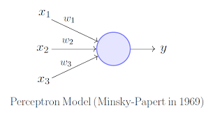

 
 

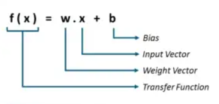

y: Girdiye ait skoru verir.
x: Girdi(input)
W: Ağırlık parametresi(weight)
b: Bias değeri
Yapay sinir ağları ya da derin öğrenme modelinde yapılan temel işlem; modelin en iyi skoru(y) vereceği 

# 1.2.	Perceptron Öğrenme Algoritması

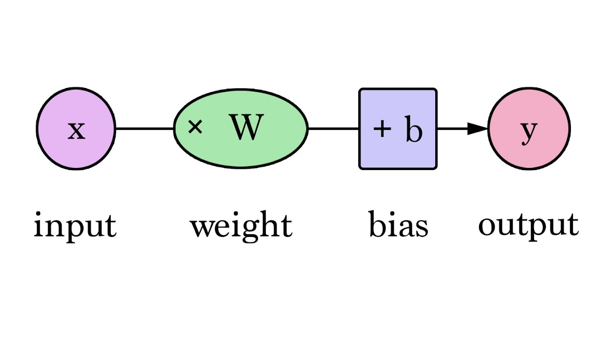

 

Yukarıdaki şekilde tanımlanan ağın yapay sinir ağındaki karşılığı perceptron’dur. Bu fonksiyonda yukarıda gösterildiği üzere W değeri ağırlık parametresi, x değeri girdi, b değeri bias ve y değeride ağın çıktısı olarak tanımlanmaktadır. Burada x girdi değerimiz, örneğin kedi resimlerini tanıyorsak kedi resmine ait matrisi, y ise bu resmin kediye ne kadar benzediğine dair skoru verir. Parametrelerimiz olan W ağırlık ve b bias değerlerini bu çıktı skorunu iyileştirmek için kullanılır.
 

# 1.3.	Perceptron Kullanım Alanları
Perceptron genellikle verilerin iki bölüme ayrılmasına olanak sağlar bu nedenle Doğrusal İkili Sınıflandırıcı olarak da adlandırılmaktadır. Perceptron öğrenme algoritmasının amacı, pozitif girdileri ve negatif girdileri doğru sınıflandırabilen bir karar sınırı (çizgi) oluşturmaktır. Doğru sınır değerine ulaşılması için girdi ve çıktı verilerinin fazla olması gerekmektedir. Model lineer olarak ayrılabilirse perceptron algoritmasının kesin sonuç üretmesi beklenir. Ancak sistem lineer olarak ayrılamıyorsa perceptron algoritması kötü sonuç üretecektir ve modeli sınıflandıramayacaktır.
 

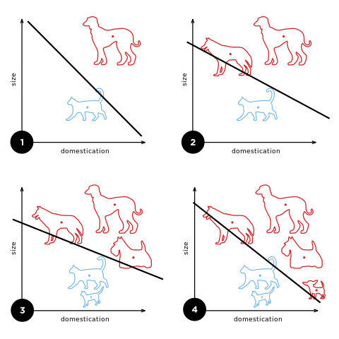

 

# 1.4.	Perceptron Sınırlamaları

Perceptron, doğrusal olmayan ayrılabilir veri noktalarını sınıflandıramaz. Çok katmanlı parametreleri içeren karmaşık problemler, Perceptronla çözülemez. Perceptron, lineer olmayan ayrılabilir veri noktalarını sınıflandıramaz. Yukarıda karşılaşılan problemlere çözüm için farklı yollarla bağlanan ve farklı aktivasyon fonksiyonlarında çalışan perceptronların bir bileşimi olan MultiLayer Perceptron kullanılmaktadır.
 

 

# **2.	Yapay Sinir Ağları**

Yapay sinir ağları (YSA), insan beyninin bilgi işleme tekniğinden esinlenerek geliştirilmiş bir bilgi işlem teknolojisidir.YSA, insan beyninin öğrenme yolunu taklit ederek beynin öğrenme, hatırlama, genelleme yapma yolu ile topladığı verilerden yeni veri üretebilme gibi temel işlevlerin gerçekleştirildiği bilgisayar yazılımlarıdır. Yapay sinir ağları; insan beyninden esinlenerek, öğrenme sürecinin matematiksel olarak modellenmesi uğraşı sonucu ortaya çıkmıştır.Yapay sinir ağları, paralel dağıtılmış ağlar, bağlantılı ağlar, nuromorfik ağlar gibi adlarla da tanımlanmaktadır.

 

# 2.1.	YSA’nın Genel Özellikleri
Yapay sinir ağları canlılardaki sinir sistemlerinin aşağıdaki işlevlerini gerçekleştirmeyi hedefler:

*Öğrenme
*İlişkilendirme
*Sınıflandırma
*Genelleme
*Tahmin
*Özellik Belirleme 

 

# 2.2.	YSA’nın Avantajları

Doğrusal Olmama, Paralellik, Hata Toleransı, Öğrenebilirlik, Genelleme, Uyarlanabilirlik, Hız, Analiz, Tasarım Kolaylığı
 

# 2.3.	YSA’nın Dezavantajları

## Eğitim Süresi: 
Eğitilmek için uzun bir zamana ihtiyaç duyarlar ve bundan dolayı zaman ve para maliyeti yüksektir.
## Eğitim Hataları: 
Bir problemin çözümünde çok uygun bir çözüm bulamayabilirler ya da hata yapabilirler. Bunun sebebi, ağı eğitecek bir fonksiyonun bulunmamasıdır. Bazı durumlarda fonksiyon bulunsa bile yeterli veri bulunamayabilir.
## Ağın Davranışlarının Açıklanamaması: 
Bu, YSA'ların en önemli sorunudur. YSA bir probleme çözüm ürettiği zaman, bunun neden ve nasıl olduğuna ilişkin bir ipucu vermez. Bu durum ağa olan güveni azaltıcı bir unsurdur.
## Donanım Bağımlı Olması: 
Yapay sinir ağları yapısı gereği paralel işlem gücüne sahip işlemcilere ihtiyaç duymaktadır. Bu nedenle gerçekleştirilmesi donanıma bağımlıdır.
## Ağın Eğitim Süresinin Bilinmemesi: 
Ağın örnekler üzerindeki hatasının belirli bir değerin altına indirilmesi eğitimin tamamlandığı anlamına gelmektedir. Bu değer bize optimum neticeler vermemektedir.
## Problemin Ağa Gösterim Zorluğu: 
YSA'lar nümerik bilgiler ile çalışabilmektedirler. Problemler YSA'lara tanıtılmadan önce nümerik değerlere çevrilmek zorundadırlar. Burada belirlenecek gösterim mekanizması ağın performansını doğrudan etkileyecektir. Bu da kullanıcının yeteneğine bağlıdır.

 

# 2.3.	YSA Yapısı

İlk yapay sinir ağı modeli 1943 yılında, bir sinir hekimi olan Warren McCulloch ile bir matematikçi olan Walter Pitts tarafından gerçekleştirilmiştir. McCulloch ve Pitts, insan beyninin hesaplama yeteneğinden esinlenerek, elektrik devreleriyle basit bir sinir ağı modellemişlerdir.

YSA ile basit biyolojik sinir sisteminin çalışma şekli taklit edilir. Biyolojik nöron hücrelerinin ve bu hücrelerin birbirleri ile arasında kurduğu sinaptik bağın dijital olarak modellenmesidir. Yapay sinir ağları yapay sinir hücrelerinin birbirine bağlanmasıyla oluşan yapılardır. 
 

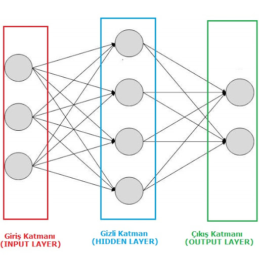

Yapay sinir ağları üç ana katmanda incelenir; Giriş Katmanı, Ara (Gizli) Katmanlar ve Çıkış Katmanı.
 

# 2.4.1.	Biyolojik Nöron Hücresi Modeli
4 bölümden oluşurlar :
*dendrit 
*gövde
*akson 
*çekirdek

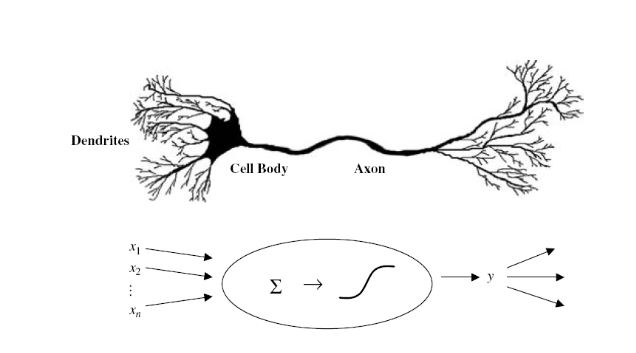

Biyolojik sinir ağlarının sinir hücreleri gibi YSA’ların da sinir hücreleri vardır. Buna proses elemanı denir. Her bir proses elemanı 5 temel kısımdan oluşur.

*Girişler
*Ağırlıklar
*Toplama Fonksiyonu
*Aktivasyon Fonksiyonu
*Çıkış

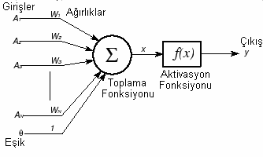

Girişler A ile gösterilmektedir. Bu girişlerin her biri ağırlık olan W ile çarpılır. Elde edilen bilgi eşik değeri ile toplanır ve sonucu oluşturmak için Aktivasyon Fonksiyonu ile işlem yapılır. Bu işlemler sonucunda y çıktısı alınır. Tüm sinirsel ağların yapısı bu temele dayanarak oluşturulur. YSA’nın öğrenme yeteneği ağırlıkların süreli olarak güncellenip ayarlanması ile doğru orantılıdır.

 

# 2.5.	YSA Çalışma Mantığı
Girdiler nöronlara gelen verilerdir. Bu girdilerden gelen veriler biyolojik sinir hücrelerinde olduğu gibi toplanmak üzere nöron çekirdeğine gönderilir. Ağırlıklar, yapay sinir hücresine gelen bilgiler girdiler üzerinden çekirdeğe ulaşmadan önce geldikleri bağlantıların ağırlığıyla çarpılarak çekirdeğe iletilir. Bu sayede girdilerin üretilecek çıktı üzerindeki etkisi ayarlanabilmektedir. Toplama fonksiyonu bir yapay sinir hücresine ağırlıklarla çarpılarak gelen girdileri toplayarak o hücrenin net girdisini hesaplayan bir fonksiyondur. Aktivasyon fonksiyonu, önceki katmandaki tüm girdilerin ağırlıklı toplamını alan ve daha sonra bir çıkış değeri (tipik olarak doğrusal olmayan) üreten ve bir sonraki katmana geçiren bir fonksiyondur. (örneğin, ReLU veya sigmoid ).

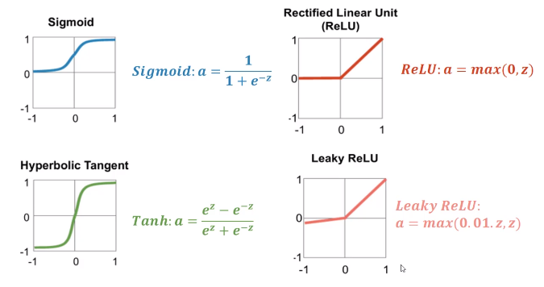

Aktivasyon fonksiyonundan çıkan değer hücrenin çıktı değeri olmaktadır. Her hücrenin birden fazla girdisi olmasına rağmen bir tek çıktısı olmaktadır. Bu çıktı istenilen sayıda hücreye bağlanabilir.
 

# 2.6.	YSA Modelleri
 

# 2.6.1.	Yapılarına Göre

 

# 2.6.1.1.	İleri Beslemeli
 

İşlem girişlerden çıkışlara doğru ilerler. Çıkış değerleri öğreticiden alınan istenen çıkış değerleri ile karşılaştırılır ve bir hata sinyali elde edilerek ağ ağırlıkları güncellenir. İleri beslemeli yapay sinir ağlarında gecikmeler yoktur. Kendi aralarında Tek katmanlı ileri beslemeli ağlar ve Çok katmanlı ileri beslemeli ağlar olarak ayrılırlar.

 

# 2.6.1.1.1.	Tek Katmanlı İleri Beslemeli
En basit ağ tipi olup bir çıktı katmanı ve buna bağlı bir girdi katmanından oluşmaktadır.

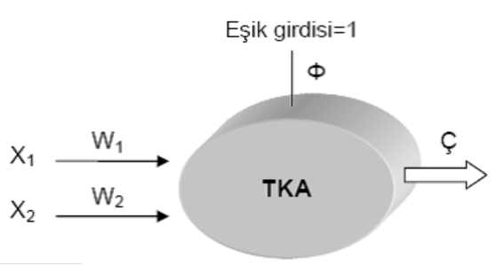

 

# 2.6.1.1.2.	Çok Katmanlı İleri Beslemeli
Girdi katmanı dış ortamlardan aldığı bilgileri hiçbir değişikliğe uğratmadan orta (gizli) katmandaki hücrelere iletir. Bilgi, orta ve çıkış katmanında işlenerek ağ çıkışı belirlenir.

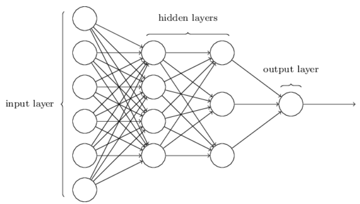

Çok katmanlı ağlar tek katmanlı ağlara göre daha karmaşık problemlerin çözümünde kullanılırlar. Çok katmanlı ağların eğitilmesi zordur.

 

# 2.6.1.2.	Geri Beslemeli 

Geri beslemeli sinir ağı, ileri beslemeli bir ağın çıkışlarının girişlere bağlanması ile elde edilir. Geri beslemeli sinir ağlarında gecikmeler vardır. Geri beslemeli sinir ağları, hücreler arası veya katmanlar arası geri besleme yapılış şekline göre farklı isimlerle söylenir.

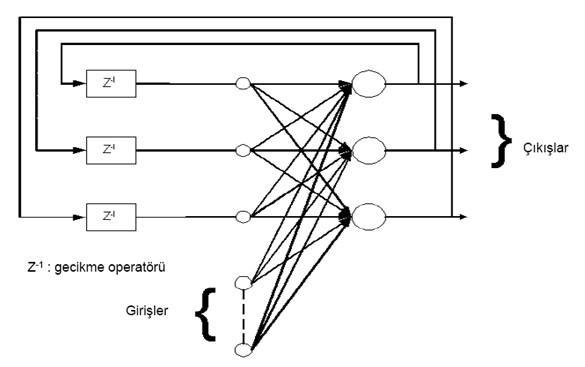

 

# 2.6.1.2.1.	Tam Geri Beslemeli
Bu ağlar gelişigüzel ileri ve geri bağlantıları olan ağlardır. Bu bağlantıların hepsi eğitilebilir.
 

# 2.6.1.2.2.	Kısmi Geri Beslemeli
Bu ağlarda, ağın hücre elemanlarına ek olarak içerik (context) elemanları vardır. Geri besleme sadece içerik elemanları üzerinde yapılır ve bu bağlantılar eğitilemezler. İçerik elemanları ara katman elemanlarının geçmiş durumlarını hatırlamak için kullanılır.
 

# 2.6.2.	Öğrenme Algoritmalarına Göre

 

# 2.6.2.1.	Danışmanlı (Supervised) Öğrenme
Eğitim sırasında sisteme bir girdi ve bir hedef çıktı vektörlerinin çift olarak verilmesi ve bunlara göre sistemdeki ağırlık değerlerinin güncellenmesi ve değiştirilmesi yapılır. Yapay sinir ağlarının eğitilmesinde kullanılan hedef çıktı 1 veya 0 olabileceği gibi bir örüntü de olabilir. Belli bir bilgi kümesine karşılık, ilgili çıktı kümesini hatırlayacak şekilde eğitilmiş sistemlere “çağrışımlı bellek” denir. Eğer, girdi vektörü ile çıktı vektörü aynı ise buna “öz çağrışımlı bellek”, çıktı vektörü farklı ise buna da “karşıt çağrışımlı bellek” denir.

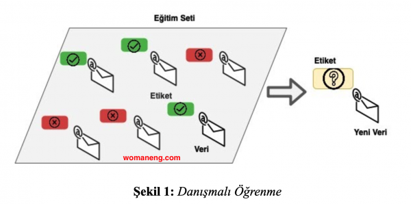

 

# 2.6.2.2.	Danışmansız (Unsupervised) Öğrenme
Bu sistemlerde, bir grup girdi vektörü sisteme verilir, ancak hedef çıktılar belirtilmez.Sistem girdiler içerisinde birbirine en çok benzeyenleri gruplar ve her bir grup için farklı bir örüntü tanımlar.Özdüzenlemeli özellik haritaları bu yöntemi kullanarak sınıflama işlemini yerine getirir.

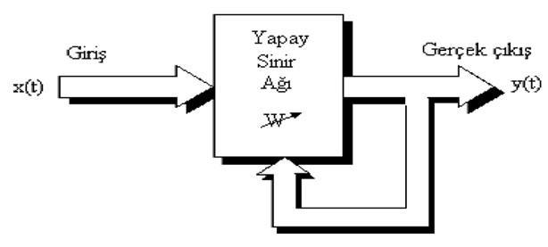

Grossberg tarafından geliştirilen ART (Adaptive Resonance Theory) veya Kohonen tarafından geliştirilen SOM(Self Organizing Map) öğrenme kuralı danışmansız öğrenmeye örnek olarak verilebilir.

 

# 2.6.2.3.	Takviyeli (Reinforcement) Öğrenme
Bu öğrenme kuralı danışmanlı öğrenmeye yakın bir metotdur. Hedef çıktıyı vermek için bir “öğretmen” yerine, burada yapay sinir ağına bir çıkış verilmemekte fakat elde edilen çıkışın verilen girişe karşılık iyiliğini değerlendiren bir kriter kullanılmaktadır. Takviyeli öğrenmede, ağın davranışlarının uygun olup olmadığını belirten bir özyetenek bilgisine ihtiyaç duyulur.Bu bilgiye göre ağırlıklar ayarlanır. Gerçek zamanda öğrenme olup, deneme-yanılma esasına göre sinir ağı eğitilmektedir.

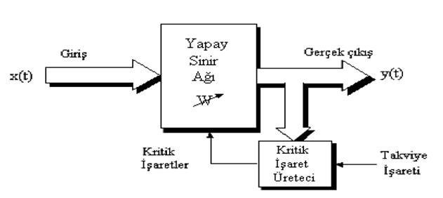

Optimizasyon problemlerini çözmek için Hinton ve Sejnowski’nin geliştirdiği Boltzman Kuralı veya Genetik Algoritmalar takviyeli öğrenmeye örnek olarak verilebilir.

 

# 2.6.2.4.	Karma Stratejiler
Danışmanlı, danışmansız veya takviyeli öğrenme stratejilerinden birkaçını birlikte kullanarak geliştirilen yapıdır.Radial Tabanlı (Radial Basis Network) ağlar ve Olasılık Tabanlı (Probabilistic Neural Network) ağlar bunlara örnek olarak verilebilir.
 

# 2.6.3.	Öğrenme Zamanına Göre YSA Modelleri

 

# 2.6.3.1.	Statik
YSA eğitim verileriyle eğitilir ve ağın yapısı kaydedilir. Ağ bundan sonra hep aynı yapıyla çalışır. Kullanımı sırasında herhangi bir değişikliğe uğramaz
 

# 2.6.3.2.	Dinamik
YSA eğitim verileriyle eğitildikten sonra kullanımı sırasında da kendini düzenlemeye devam eder. Böylece sürekli öğrenen bir YSA elde edilebilinir.
 

# 2.7.	YSA’nın Çalışması

Yapay sinir ağlarının yapı taşı olan yapay sinir hücreleri kendilerine verilen girdileri her bir girdiye ait ağırlığa göre değerlendirerek çıkışını üretir.

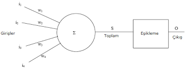

YSA giriş katmanından aldığı verileri ara katmanlarda işleyerek çıkış katmanına iletir.

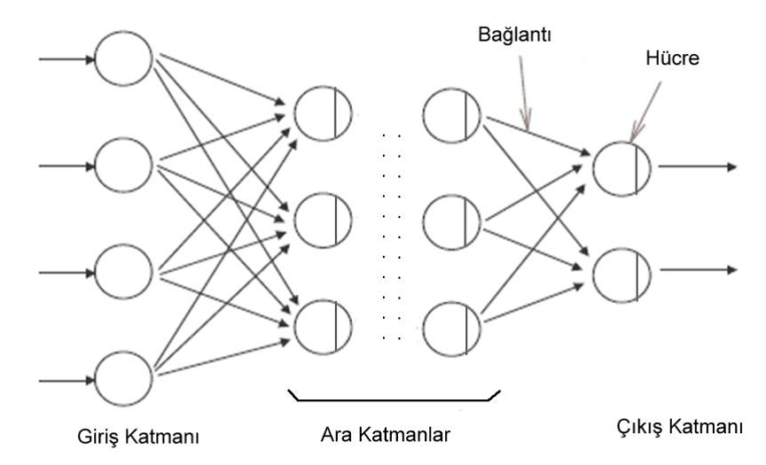

 

# 2.7.1.	Back Propagation

Yapay sinir ağlarında en çok kullanılan öğrenme algoritmalarından biri geri yayılmalı (back propagation) öğrenme algoritmasıdır. Bu algoritmada her iterasyon sonucunda çıkış katmanındaki hata hesaplanarak bu hata çıkış katmanından giriş katmanına doğru bütün nöronlara iletilir ve ağırlıklar hata payına göre tekrar düzenlenir.

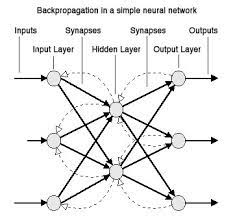

Geri yayılma algoritmasında çıkış katmanındaki nörona ait hata payı kendinden önceki nöronlara ağırlıklarıyla orantılı olarak dağıtılır. Her nöron için hata payı bulunduktan sonra bu hata payları yardımıyla yeni ağırlıklar hesaplanır.

 

# 2.8.	YSA Öğrenme Kuralları

 

# 2.8.1.	Çevrimiçi (On-line) Öğrenme Kuralları 

Bu kurallara göre öğrenen sistemler gerçek zamanda çalışırken bir taraftan fonksiyonlarını yerine getirmekte diğer taraftan ise öğrenmeye devam etmektedir. ART ve Kohonen öğrenme kuralı bu sınıfa girmektedir.
 

# 2.8.2.	Çevrimdışı (Off-line) Öğrenme Kuralları
Bu kuralları kullanan sistemler eğitildikten sonra gerçek hayatta kullanıma alındığında artık öğrenme olmamaktadır. Sistemin öğrenmesi gereken yeni bilgiler söz konusu olduğunda sistem kullanımdan çıkarılmakta ve çevrimdışı olarak yeniden eğitilmektedir.
 

# 2.9.	YSA'nın Tasarımı
Bir yapay sinir ağının tasarlanmasında öncelikle gereksinimler belirlenip buna göre uygun bir YSA modeli kullanılır. YSA tasarımında aşağıdaki kriterler belirlenmelidir.

*Öğrenme Algoritması
*Ağdaki Katman Sayısı
*Her Bir Katmandaki Nöron Sayısı
*Nöronların Aktivasyon Fonksiyonu

# 2.10.	Örnek YSA Modelleri

Üç katmanlı, üç girişli, bir çıkışlı, ileri beslemeli, geri yayılmalı öğrenme algoritması 
 

# 2.11.	Yapay Sinir Ağlarında En Çok Kullanılan Modeller

Çok Katmanlı Algılayıcılar
Kohonen Ağı
CounterPropogation Ağı
Algılayıcılar (Perceptronlar)
Hoppfield Ağı
Adaptive Rezorans Teorisi Modeli (ART)
Lineer Vektör Quantization Modeli (LVQ)
Jordan Ağı
Elman Ağı
Probabilistic Ağı
Neocognitron Ağı
Boltzman Makinesi
Kendi Kendini Organize Eden Model (SOM)
Radyal Temelli Ağ(RBN)

 

# 2.12.	Yapay Sinir Ağlarının Eğitilmesi

YSA’da hücre elemanlarının bağlantılarının ağırlık değerlerinin belirlenmesi işlemine “ağın eğitilmesi” denir.Başlangıçta bu ağırlık değerleri rastgele alınır.YSA’lar, kendilerine örnekler gösterildikçe bu ağırlık değerlerini yenileyerek amaca ulaşmaya çalışırlar.
 

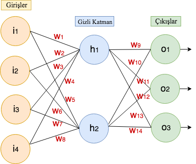

Amaca ulaşmanın veya yaklaşmanın ölçüsü de yine dışarıdan verilen bir değerdir.Eğer yapay sinir ağı verilen giriş-çıkış çiftleriyle amaca ulaşmış ise ağırlık değerleri saklanır.Ağırlıkların sürekli yenilenip istenilen sonuca ulaşılana kadar geçen zamana “öğrenme” denir.Ağırlık değerlerinin değişmesi belirli kurallara göre yürütülmektedir. Bu kurallara “öğrenme kuralları” denir.

Yapay sinir ağı öğrendikten sonra daha önce verilmeyen girişler uygulanarak ağ çıkışları gözlemlenir.Genelde eldeki örneklerin %80’i ağa verilip ağ eğitilir. Daha sonra geri kalan %20’lik kısım verilip ağın davranışları incelenir ve bu işleme “ağın test edilmesi” denir. Eğitimde kullanılan örnekler setine “eğitim seti”, test için kullanılan sete ise “test seti” denir.

# 2.13.	YSA’nın Uygulama Alanları

 

# 2.13.1.	Ses Tanıma
Girişleri -yani konuşulan bir kelimenin hesaplanan katsayılarını- veririz. Çıkışların hesaplanması için YSA’yı çalıştırırız. Daha sonra programınızda çıkışları inceleyerek çıkışların gösterdiği koda göre söylenen kelimeyi anlamaya çalışırız. Ayrıca bu yöntemle sadece ses değil benzer yapıdaki hemen hemen her şeyi belli bir doğruluk ile tanıyabilir, bir birinden ayırabilirsiniz. Bunlara örnek olarak matematiksel fonksiyonlar, elle veya makine ile yazılmış karakterler ya da elektronik devrelerin giriş ve çıkışları verilebilir.

 

# 2.13.2.	Tıp Alanında
YSA’nın kalp krizi teşhisinde kullanılması ve doktorlardan daha iyi sonuç alması.

 

# 2.13.3.	İlaç Geliştirme
Milli sağlık kuruluşlarındaki araştırmalar AİDS ve Kanseri tedavi etmek amacıyla ilaç geliştirme sürecinde YSA’ları kullanmaktadırlar. YSA’lar ayrıca biomolekülleride modelleme sürecinde de kullanılır.
 

# 2.13.4.	Pazarlama
Departman izleme ve uygun tavsiyeler verme için kullanılır.
 

# 2.13.5.	Finans 
Bankacılıkta, kredi kartı şirketleri ve faiz kurumları net olmayan kararlarla uğraşır.Bu alanlar öğrenme ve istatistiki eğilim gerektirir.
 

# 2.13.6.	Haberleşme
Ses dalgalandırma, Dizayn, Yönetim, Yönlendirme, Kontrol, Ağ gözetimi işlerinde kullanılır.

 

Yukarıda belirttiğimiz alanlar ve daha bir çok alanda da kullanılmaktadır. (Üretim, Arazi analizi ve tespiti, Otomasyon ve Kontrol, Savunma sanayi, Görüntü işleme, İşaret işleme, Desen tanıma, Askeri sistemler, Güç sistemleri

# **3.	RNN Algoritması**
RNN’ler genelde bir sonraki adımı tahmin etmek için kullanılan bir çeşit Derin Öğrenme yapılarıdır. Diğer derin öğrenme yapılarından en büyük farkları ise hatırlamalarıdır.Bir diğer farkları ise, diğer sinir ağlarında her girdi birbirinden bağımsız iken RNN’lerde girdiler birbiri ile ilişkilidir.RNN’ler bir sonraki adımı takip edebilmek için girdiler arasında ilişki kurarlar ve eğitilirken tüm ilişkilerini hatırlarlar.
		
RNN’ler kurmuş oldukları ilişkilerin kalıcı olması için kendi içlerinde dönen döngü benzeri bir yapı kullanırlar.

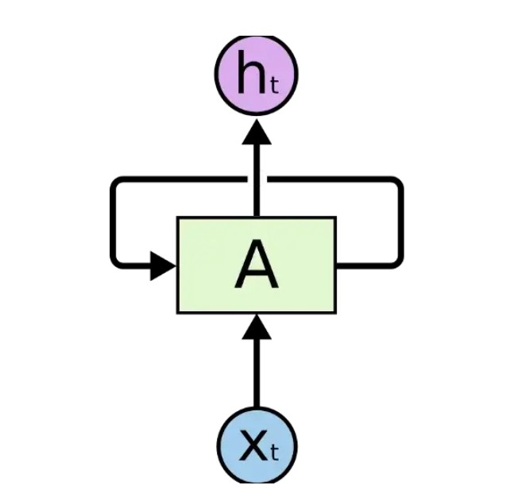
 

# 3.1.	RNN Algoritması Çalışma Mantığı
Giriş katmanı 'x', sinir ağına girdi alır ve onu işler ve orta katmana iletir. Orta katman 'h', her biri kendi aktivasyon fonksiyonlarına, ağırlıklarına ve sapmalarına sahip birden çok gizli katmandan oluşabilir. Farklı gizli katmanların çeşitli parametrelerinin önceki katmandan etkilenmediği bir sinir ağınız varsa, yani: sinir ağının belleği yoksa, o zaman tekrarlayan bir sinir ağı kullanabilirsiniz. Tekrarlayan Sinir Ağı, her gizli katmanın aynı parametrelere sahip olması için farklı aktivasyon fonksiyonlarını ve ağırlıkları ve önyargıları standartlaştıracaktır. Ardından, birden çok gizli katman oluşturmak yerine, bir tane oluşturacak ve gerektiği kadar döngü yapacaktır.

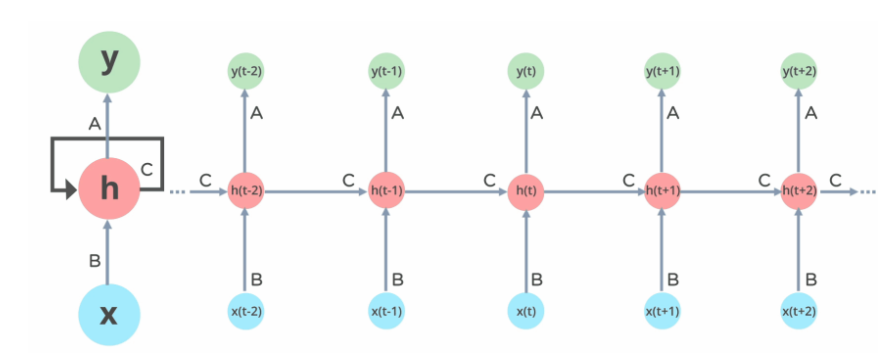

# 3.2.	RNN Algoritması Tarihi
Yinelemeli sinir ağları David Rumelhart'ın 1986 yılındaki çalışmasına dayanır. 1993 yılında, bir RNN çalışması 1000'den fazla katman gerektiren bir “çok derin öğrenme” görevini başarmıştır. Long short-term memory (LSTM) ağları Hochreiter ve Schmidhuber tarafından 1997 yılında geliştirilmiş ve çeşitli uygulama alanlarında en iyi performansları kaydetmiştir.

 

# 3.3.	RNN Algoritması Matematiği
h_t: Şu anki h değeri
h_t-1: Bir önceki h değeri
x_t: Şu anki girdi vektörü

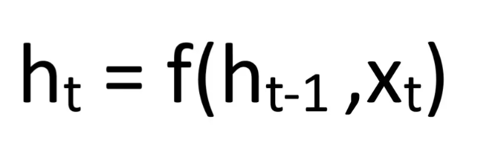

 

# 3.4.	RNN Algoritması Çeşitleri
 

# 3.4.1.	Tam Yinelemeli
 

Tam yinelemeli sinir ağlarında tüm nöronların çıktısı tüm nöronların girdisine bağlanır. En genel RNN mimarisi budur, çünkü diğer tüm mimariler, buradaki bazı bağların ağırlıkları sıfırlanarak elde edilebilir. RNN'ler iki farklı biçimde gösterilir: kapalı biçimde, özyineleme bağlantıları düğümlerin kendilerinin bir sonraki adımdaki durumuna olan bağlantılarıdır; açılmış biçimde, düğümlerin her zaman adımındaki durumları ayrı ayrı gösterilir.

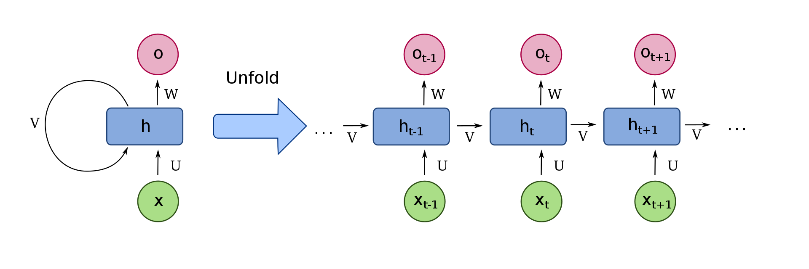

# 3.4.2.	Geçitli Yinelemeli
Geçitli yineleme birimi (gated recurrent unit, GRU) 2014 yılında önerilmiş bir yinelemeli ağ birimidir. Bu birimler, nöronlar arasındaki geçişi düzenleyen bir takım öğeler barındırır. LSTM'e benzer şekilde unutma kapısı bulunur, ancak GRU yapıları genellikle daha basittir. Polifonik müzik ve konuşma sinyali modelleme gibi işlerde LSTM'e benzer bir başarıyla çalışır.

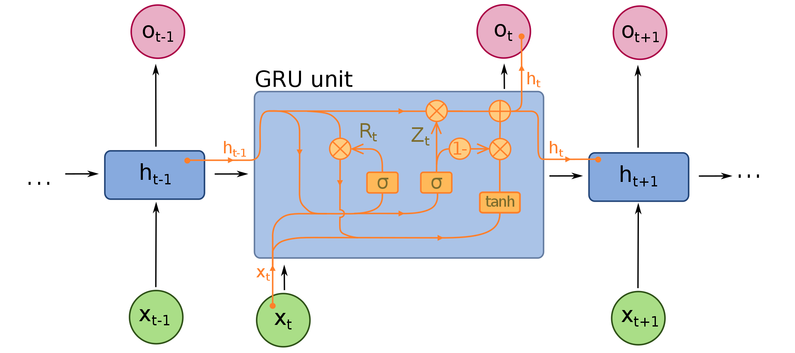

# 3.5.	Vanishing Gradient Problemi
Aktivasyon fonksiyonları sayesinde girdimizi belirli bir aralığa indirgeyebiliriz. Bu aralık genelde -1 ve 1 veya 0 ve 1 aralığıdır. Ufak bir alana indirgediğimiz için girdimizdeki büyük bir değişim aktivasyon fonksiyonunda o kadar büyük bir değişime yol açmayabilir.
RNN’de çok erken aşamalarda dahi bu durum gerçekleşebilir. 
Bu katmanlar öğrenmediği için, RNN’ler daha uzun metinlerde gördüklerini unutabilir ve böylece kısa süreli bir hafızaya sahip olurlar.

# 3.6.	Vanishing Gradient Problemi Çözümü LTSM

LSTM yapısı içerisindeki kapılar (gate) neyin hatırlanacağını, neyin unutulacağını belirler. Yani gelen girdi önemsizse unutulur, önemliyse bir sonraki aşamaya aktarılır. Bunu Gate ve Cell State yardımıyla yapar.
# 3.6.1.	Forget Gate (Unutma Kapısı)
Hangi bilginin tutulacağı veya unutulacağına karar verir. Mantığı bir sayı 0 ile çarpılırsa ne kadar büyük olursa olsun sonuç 0 olur. Burada da unutmak için girdinin ağırlığına 0 verilir.
Bir önceki gizli katmandan gelen bilgiler ve güncel bilgiler Sigmoid Fonksiyonundan geçer. 0'a ne kadar yakınsa o kadar unutulacak, 1'e ne kadar yakınsa o kadar tutulacaktır.

# 3.6.2.	Input Gate (Girdi Kapısı)
Cell State’i güncellemek için kullanılır. Öncelikle Forget Gate’de (Unutma Kapısı) olduğu gibi Sigmoid fonksiyonu uygulanır, hangi bilginin tutulacağına karar verilir. Daha sonra ağı düzenlemek için Tanh fonksiyonu yardımıyla -1,1 arasına indirgenir ve çıkan iki sonuç çarpılır.

# 3.6.3.	Cell State

Cell State’in hücre içerisindeki en önemli görevi bilgiyi taşımaktır. Taşınması gereken verileri alır ve hücre sonuna, oradan da diğer hücrelere taşır. Yani ağ üzerinde veri akışını Cell State yardımıyla sağlarız. İlk olarak Forget Gate’den (Unutma Kapısı) gelen sonuç ile bir önceki katmanın sonucu çarpılır. Daha sonra Input Gate’den (Girdi Kapısı) gelen değer ile toplanır.

# 3.6.4.	Output Gate

Bir sonraki katmana gönderilecek değere karar verir. Bu değer, tahmin için kullanılır. Öncelikle bir önceki değer ile şu anki girdi Sigmoid fonksiyonundan geçer. Cell State’den gelen değer Tanh fonksiyonundan geçtikten sonra iki değer çarpılır ve bir sonraki katmana “Bir önceki değer” olarak gider. Cell State ilerler.

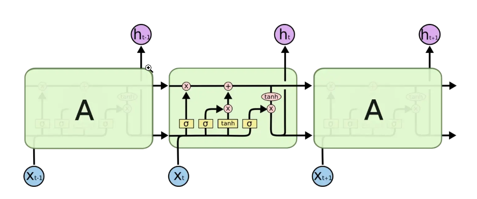

# 3.7.	RNN Algoritması Avantajları

Bir önceki örnek ile ilişki kurar. Bu sayede girdiler unutulmadan ilerlenir. Kullanım alanı çok geniştir. (Metin ve ses verileri, sınıflandırma problemleri, regresyon problemleri, üretken (generative) modellerde kullanılır.) Girdi büyüklüğüyle model boyutunun artmaması. Zaman içinde ağırlıkların paylaşılması

# 3.8.	RNN Algoritması Dezavanatajları

Uzun girdilerin işlenmesinin zor olması. Yavaş hesaplama yapması ,Uzun zaman önceki bilgiye erişme zorluğu, Mevcut durum için gelecekteki herhangi bir girdinin düşünülememesi

# 3.9.	RNN Algoritması Kullanım Alanları

# 3.9.1.	Resim Yazısı Ekleme

RNN'ler, mevcut etkinlikleri analiz ederek bir görüntüye altyazı eklemek için kullanılır.

# 3.9.2.	Zaman Serisi Tahmini
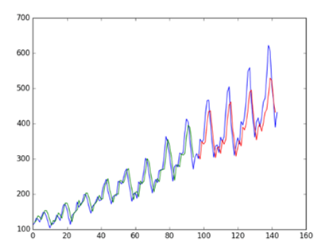

Belirli bir aydaki hisse senedi fiyatlarını tahmin etmek gibi herhangi bir zaman serisi sorunu bir RNN kullanılarak çözülebilir.

# 3.9.3.	Doğal Dil İşleme

Metin madenciliği, Duygu analizi, Doğal Dil İşleme (NLP) bir RNN kullanılarak gerçekleştirilebilir.

# 3.9.4.	Makine Çevirisi

Bir dilde girdi verildiğinde, girdiyi çıktı olarak farklı dillere çevirmek için RNN'ler kullanılabilir.

# **4.	Kaynakça**

>Biswal, A. (2020, April 24). Recurrent Neural Network (RNN) Tutorial: Types and Examples [Updated] | Simplilearn. Simplilearn.com. https://www.simplilearn.com/tutorials/deep-learning-tutorial/rnn

>Wikipedia. (n.d.). Wikipedia. https://www.wikipedia.org/

>Biswal, A. (2020, April 24). Recurrent Neural Network (RNN) Tutorial: Types and Examples [Updated] | Simplilearn. Simplilearn.com. https://www.simplilearn.com/tutorials/deep-learning-tutorial/rnn
Wikipedia. (n.d.). Wikipedia. https://www.wikipedia.org/
Yapay Sinir Ağı(Artificial Neural Network) Nedir? - Veri Bilimi Okulu. (n.d.). Veri Bilimi Okulu. https://www.veribilimiokulu.com/yapay-sinir-agiartificial-neural-network-nedir/

>Biswal, A. (2020, April 24). Recurrent Neural Network (RNN) Tutorial: Types and Examples [Updated] | Simplilearn. Simplilearn.com. https://www.simplilearn.com/tutorials/deep-learning-tutorial/rnn
Sinir Ağı Nedir? Yapay Zeka ve Makine Öğrenimi Kılavuzu - AWS. (n.d.). Amazon Web Services, Inc. https://aws.amazon.com/tr/what-is/neural-network/
Wikipedia. (n.d.). Wikipedia. https://www.wikipedia.org/
Yapay Sinir Ağı(Artificial Neural Network) Nedir? - Veri Bilimi Okulu. (n.d.). Veri Bilimi Okulu. https://www.veribilimiokulu.com/yapay-sinir-agiartificial-neural-network-nedir/

>Yapay Sinir Ağı(Artificial Neural Network) Nedir? - Veri Bilimi Okulu. (n.d.). Veri Bilimi Okulu. https://www.veribilimiokulu.com/yapay-sinir-agiartificial-neural-network-nedir/

>What are Recurrent Neural Networks? | IBM. (n.d.-d). IBM - Deutschland | IBM. https://www.ibm.com/topics/recurrent-neural-networks
